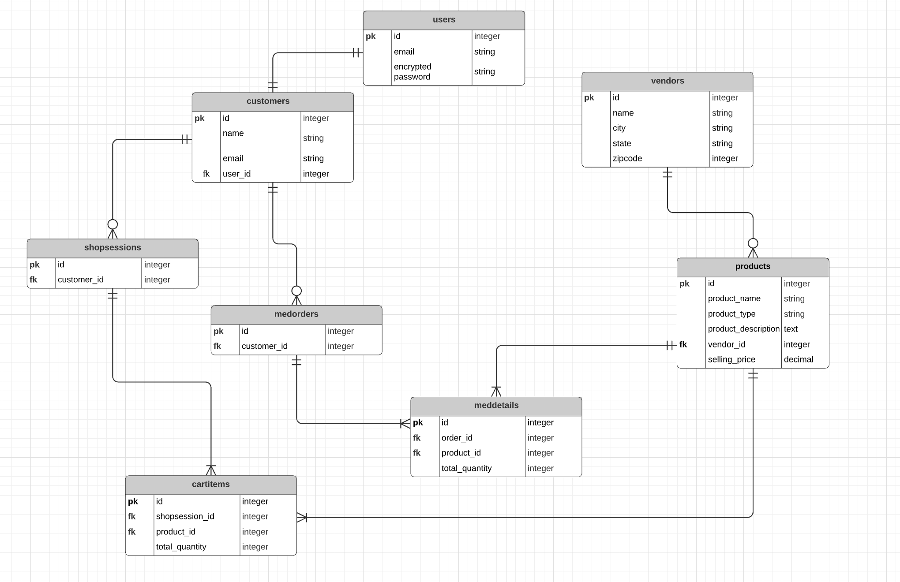

**Documentation**

**R7	Identification of the problem you are trying to solve by building this particular marketplace app.**

Often due to natural calamities or administrative process delays, medical facilities face a shortage of necessary regularly used medical equipment. This website will help bring multiple vendors who sell medical equipment online with the medical facility owners. This way medical healthcare facilities don't have to rely upon their fixed vendors and have access to multiple suppliers. Also, medical facilities that have an abundant supply or availability of medical devices can lease these devices to other medical facilities which will help reduce the cost and time for purchase and can be immediately used for patient care in difficult times.

**R8	Why is it a problem that needs solving?**

It has been observed that in many countries across the world healthcare facilities have experienced a huge shortage of medical equipment during the COVID pandemic. This has burdened the medical system and decreased the operational flow. This has led to challenging situations for doctors and nurses to treat their patients effectively with the limited supply of medical equipment.

**R9	A link (URL) to your deployed app (i.e. website)**
**R10	A link to your GitHub repository (repo).**

**R11	Description of your marketplace app (website), including:
- Purpose
- Functionality / features
- Sitemap
- Screenshots
- Target audience
- Tech stack (e.g. html, css, deployment platform, etc)**

**Purpose**
To help medical facilities buy medical equipment and devices online from multiple vendors. It will help them to curb the shortage of supply and continue patient care effectively.

**R12	User stories for your app**
1. As a user (medical facility owner), I should be able to view the  general listings of medical equipments from various vendors, so that it helps me find what I am looking for.
2. As a user (medical facility owner), I should be able to log in with proper authentication into my account to make any  purchase and know further details about equipments.
3. As a user I should be able to see the Vendor listing with their reviews to make prudent decision about which vendor supplies at best costs or provided equioment in fastest delivery time 

**R13	Wireframes for your app**

**R14	An ERD for your app**

**R15	Explain the different high-level components (abstractions) in your app**

**R16	Detail any third party services that your app will use**

**1. Devise**

Devise is used in the app for User Authentication. 

**Helpful Features:**
It provided 

**R17	Describe your projects models in terms of the relationships (active record associations) they have with each other**

**R18	Discuss the database relations to be implemented in your application**

**R19	Provide your database schema design**

**R20	Describe the way tasks are allocated and tracked in your project**