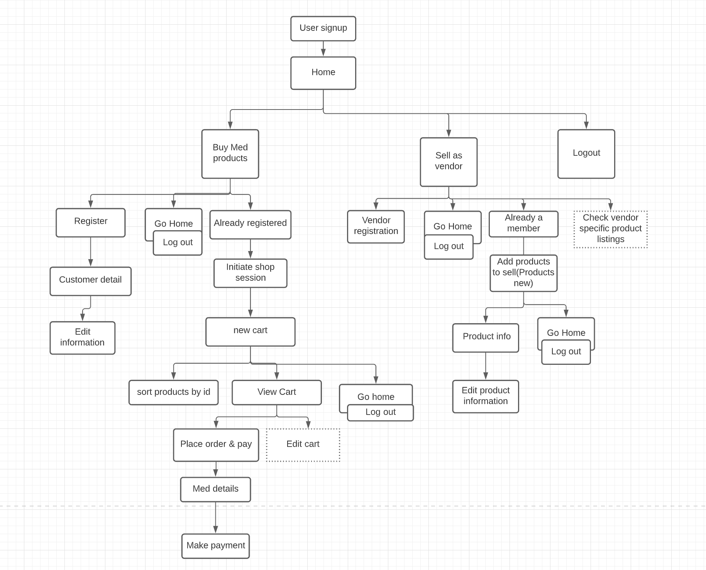
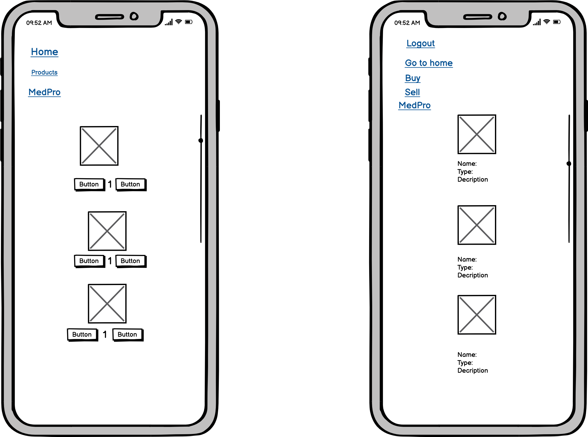
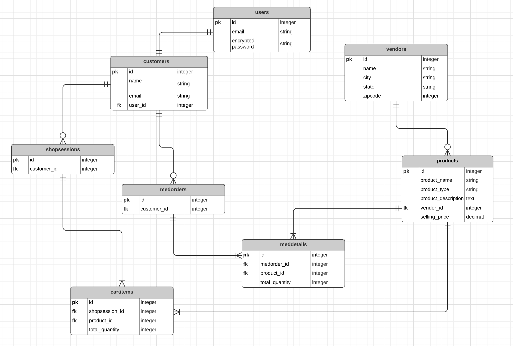
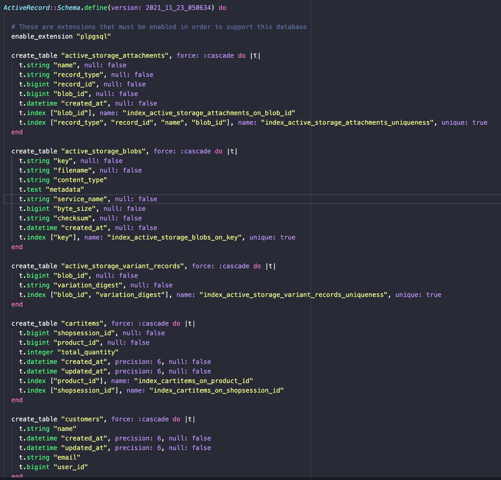
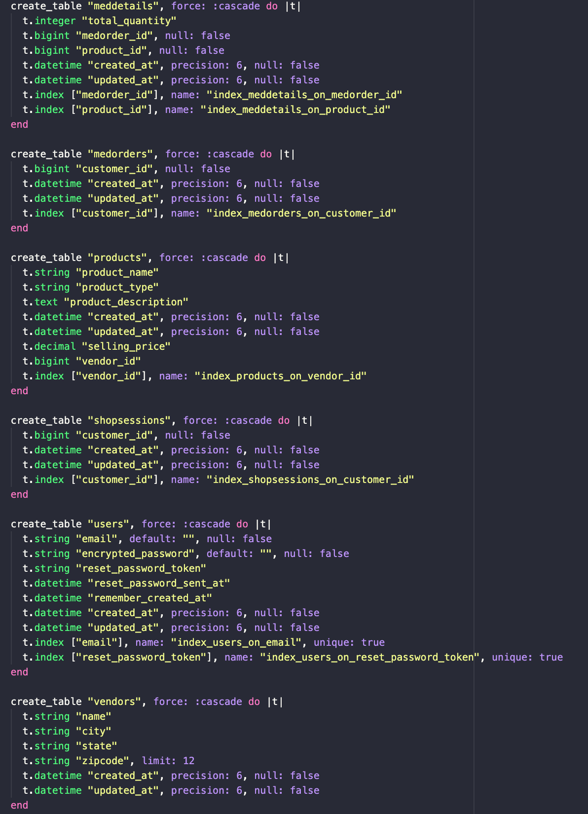
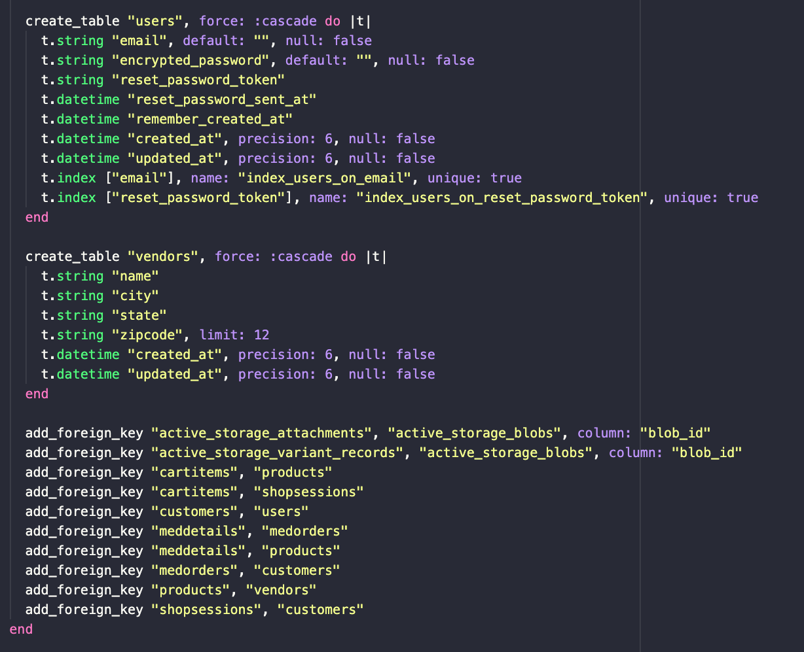

**R7	Identification of the problem you are trying to solve by building this particular marketplace app.**

Due to natural calamities or administrative process delays, medical facilities face a shortage of necessary regularly used medical equipment. This website will help bring multiple vendors who sell medical equipment and connect them online with the medical facility owners. Through this website, the medical healthcare facilities no more have to depend upon their fixed vendors. They now have access to multiple suppliers. It will reduce the lag time for medical facilities to purchase medical devices without affecting the smooth delivery of patient care. This website will bring the suppliers and buyers of medical equipment under one roof.

**R8	Why is it a problem that needs solving?**

It has been observed that in many countries across the world, healthcare facilities have experienced an acute shortage of medical equipment during the **COVID pandemic**. It has burdened the medical system and decreased the operational flow. Also, it has led to challenging situations for doctors and nurses to treat their patients effectively with only a limited supply of medical equipment.This website aims to relieve this burden on medical facilities and help to obtain medical devices from multiple suppliers in times of shortage.

**R9	A link (URL) to your deployed app (i.e. website)**

**R10	A link to your GitHub repository (repo).**

[**Github repository**](https://github.com/inverseswirl/ShriyaDhar_T2A2)

**R11 Description of your marketplace app (website), including:**
**- Purpose**
**- Functionality / features**
**- Sitemap**
**- Screenshots**
**- Target audience**
**- Tech stack (e.g. html, css, deployment platform, etc)**

**Purpose**
To help medical facilities buy medical equipment and devices online from multiple vendors.
It will help them to curb the shortage of supply and continue patient care effectively.

**- Functionality / features**

**Buyer**
1. View the product lists
2. Add items to the cart
3. Place an order and generate bill details.
4. Add customer or buyer information.
5. Update buyer information.

**Vendor**
1. Add vendor information.
2. Add products to sell.
3. Update information on products to sell.

**Sitemap**

**Screenshots**

**Target audience:**

The target audience is the vendors or suppliers of medical equipment and the medical facility owners such as hospitals, medical centres etc.

**Tech stack (e.g. html, css, deployment platform, etc)**

**Coding languages:**
- Ruby
- HTML/CSS

**Frameworks:**
- Ruby on Rails

**R12	User stories for your app**

1. As a user (medical facility owner), I should be able to view the general listings of medical equipments from various vendors, so that it helps me find what I am looking for.
2. As a user (medical facility owner), I should be able to log in with proper authentication into my account to make any purchase and know further details about medical equipment.
3. As a user(vendor) I should be able to add vendor information, so that I can register for selling products online.
4. As a user(vendor) I should be able to add products that I wish to sell, so that my products are visible to buyers and they can buy these from the website.
5. As a user (medical facility owner), I should be able to initiate shop sessions whenever I visit the website and be able to add items to the cart.
6. As a user (medical facility owner), I should be able to place an order if I wish to continue and generate an order, so that my cart is finalised and I can proceed to payment.

 

**R13	Wireframes for your app**

The wireframes are provided in wireframes folder inside docs folder.

Example:

**R14	An ERD for your app**

**R15	Explain the different high-level components (abstractions) in your app**

**MVC architecture of marketplace app:**

**Model**

Model represents the Active record or the data of the marketplace app. Through Object-relational mapping, these models or classes connect to their respective database tables. **`ActiveRecord**` helps to do the object-relational mapping which is also the parent class for all models.
This helps to retrieve the data from the database and use it in the app logic.

The models generated are User, Customer, Vendor, Shopsession, Cartitem, Product, Medorder and Medddetail.

**Controller**

The controllers in the app help to route the HTTP request to the appropriate action or method that extracts data from the model and delivers the output to the user through views. Thus, the controller is a binder that binds the data in the model with the output in views.

The controllers generated are:

**Products Controller:**
It helps to obtain data from Product model and displays through views the newly added products complete product list. also, it helps to update or edit the products information.

**Customers Controller**
It helps to obtain data from Customer model and displays through views the customer information. It also helps to update or edit the customer's information.

**Carts controller**
It helps to obtain data from Cartitem model and displays through views the cart information. Using this controller, we can create new cartitems and add them to the cart.

**Medorders controller**
It is a binder controller that helps to extract data from Customer model and create new shopsession for that customer.
So, it deals with two models - Customer and Shopsession.

**Meddetails controller**
This controller has very dynamic use. It helps to create new data for Medorder and Meddetail models and saves them. This helps to update the actual materialized order with its details.

**Vendors controller**
It helps to obtain data from Vendor model and displays through views the vendor information. It also helps to update or edit the vendor information.

**Views**

There are separate views for each controller. Each controller has an index, new, edit and show.html.erb files in it. The view compiles the response by the controller and displays it to the user.

**Database:**
The marketplace app uses the PostgreSQL database system.PostgreSQL is a relational database system. Each model object maps to respective database tables.  

**Web server:**
Rails app comes with default Puma server. It gets started by using the command `rails s` in the terminal. This helps to initiate a web server on the development machine.

**R16	Detail any third party services that your app will use**

**1. Devise**

Devise is used in the app for User Authentication. It is based on the Warden framework that provides authentication for the Rails application.

**Helpful Features:**
- It provides a user sign up and sign in option for user authentication.
- It helps to store user password in hashes in encrypted form when the user logs in.
- It provides inbuilt devise views for registrations, sessions, conformation, mailer etc.
- It also has a reset password option and send reset instructions option.
- It provided and supports option to integrate Omniauth into user model.

**2. S3 AWS cloud storage**
The marketplace app uses the Amazon S3 cloud bucket to store the product images uploaded using the upload option in the new product form.

**Helpful features:**
- It provides more active cloud data storage. So there is no need to worry about saving a lot of images within the app.
- It comes at zero costs under the free plan. This plan is used currently for this app. So, the cost of service is essentially free.
- The uploads are faster.
- The bucket files are accessible by only the creator or owner of the bucket. No one else can access them unless they have the master key. 

**R17	Describe your projects models in terms of the relationships (active record associations) they have with each other**

**1.belongs_to association**
It refers to the association where every new instance created for a model belongs_to one instance of another model.

Customer model helps to define the data for customers such as their name or email. Customer model connects with the `User` model, `Medorders` and `Shopsession` models. Customer model has a `belongs_to` association with the User model.

Product model is associated with Vendor model by belongs_to association as one specific type of product will have only one vendor. So, product **belongs_to** vendor.

**2. has_many association**

Separate models named `Cartitem` and `Shopsession` are created as a customer can visit the website multiple times, initiate multiple shop sessions, add products in the cart, but never finalize the order if he/she changes his mind. So, the shopsession doesn't materialize into an actual order. Hence, there are separate models. Thus, one customer `has_many association` with the `Shopsession` model.

When the customer chooses to view the cart and continues to place an order, the order is finalised. Then comes the role of model **Medorder and Meddetails**. The finalised medorder data such as medorder id, customer_id, order time etc is stored inside medorders table. One customer **has_many** association with Medorders model as one customer can be associated with multiple medorders. Also, one Medorder placed with have multiple details so it has_many association with Meddetails model.

There is a separate `Vendor` model. It **has_many** association with the `Product` model as a single vendor can sell or list many products. One vendor **has_many products.**

**Polymorphic association**
It is an association where one model is associated with two other models. 

Medorders and Products models have many to many relationships as many medorders can have many products and many products can be bought in many medorders.  So, Meddetails **belongs_to** Medorders & Products. It references these two tables. On the other side of the association, **Products and Medorders** have a **has_many** association with Meddetails.

Similarly,
Cartitem model **belongs_to** Shopsession model and Product model. Shopsession and Product have a **has_many** association with Cartitem model.
Cartitem is associated with Shopsession and Product; and has shopsession_id and product_id as foreign keys.

**R18	Discuss the database relations to be implemented in your application**

**Database Tables in the database**
1. users
2. customers
3. vendors
4. products
5. cartitems
6. shopsessions
7. meorders
8. meddetails

**Primary key**
Primary key describes every row of the table uniquely.

**Foreign key**

An association between two or more tables is established using a foreign key. A table with a foreign key means it is referencing another table.

**One-to-One**

users and customers have one to one relationship as one customer can be only one user after authentication.

**One-to-many**

customers and medorders have a one-to-many relationship as one customer can place zero to many medorders. Similarly, vendors have a one-to-many relationship with products as one vendor can have many products.

Other tables with one-to-many relationships are:

**customer to shopsessions** - one customer can have multiple shopsessions.
**shopsessions to cartitems** - one shopsession to multiple cartitems
**products to meddetails** - one product to multiple meddetails
**products to cartitems**  - one product to multiple cartitems

**Many-to-Many**

products and medorders have a many-to-many relationship. So, a new table is created named Meddetails that contains a foreign key for **product_id and medorder_id.** This creates a polymorphic association between the associated tables. The database table that joins the two other tables in a many-to-many relationship is called a **bridge table**.

**R19	Provide your database schema design**

 

**R20	Describe the way tasks are allocated and tracked in your project**

The project management tools used for tracking project activities:
1. [Agile board project tracking ](https://trello.com/b/vvhqCtBf/agile-boardprojecttracking)
2. [Kanban tracking](https://trello.com/b/2gLoKbd5/kanbantracking)